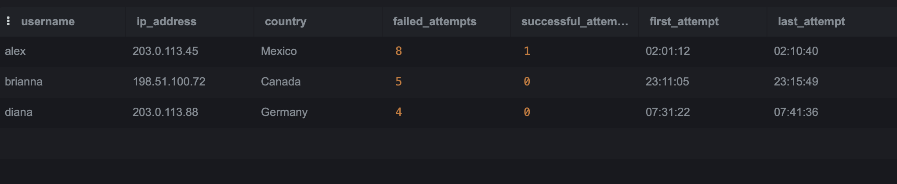

# SQL Login Security Investigation

## Project overview

This beginner-friendly security investigation uses SQLite to analyze fictional authentication logs. The goal is to identify repeated failures, after-hours activity, suspicious source IP addresses, and a possible successful brute-force attack.

All usernames and IP addresses in this project are fictional. The IP ranges are reserved for documentation and examples.

## Skills demonstrated

- Creating and querying a relational database
- Filtering records with `WHERE`, `AND`, `OR`, and `IN`
- Grouping and counting events with `GROUP BY`, `COUNT`, and `HAVING`
- Using `CASE` expressions and conditional aggregation
- Sorting results with `ORDER BY`
- Analyzing authentication patterns and documenting findings
- Recommending incident-response actions

## Scenario

A security team observed repeated failed login attempts, activity outside normal business hours, and logins from unusual locations. I analyzed 25 fictional login events to identify accounts and IP addresses that required investigation.

## Dataset

The `log_in_attempts` table contains:

| Column | Description |
|---|---|
| `event_id` | Unique event number |
| `username` | Account involved in the login |
| `login_date` | Date of the attempt |
| `login_time` | Time of the attempt |
| `country` | Reported source country |
| `ip_address` | Source IP address |
| `success` | `0` for failure and `1` for success |

Run [`setup.sql`](setup.sql) first to create and populate the database. Then run the queries in [`investigation_queries.sql`](investigation_queries.sql).

## Key findings

- The dataset contained 20 failed login attempts.
- Nineteen failed attempts occurred outside the defined 08:00–18:00 business hours.
- The `alex` account had eight failures followed by one successful login.
- These events came from `203.0.113.45` in Mexico between 02:01:12 and 02:10:40.
- `brianna` had five failed attempts, and `diana` had four.
- Each source IP targeted only one username, so the data did not indicate password spraying.

## Analysis

The `alex` account was the highest-priority finding because eight rapid, after-hours failures from one IP address were followed by a successful login. This pattern may indicate a successful targeted brute-force attack. However, authentication logs alone cannot prove account compromise; the activity could also involve a legitimate user entering an incorrect password repeatedly.

## Recommended response

1. Temporarily secure the `alex` account and terminate active sessions.
2. Contact the account owner to verify whether the activity was legitimate.
3. If unauthorized, reset the password and require multi-factor authentication.
4. Review endpoint, application, file-access, MFA, and account-change logs.
5. Check whether the source IP appears in other security events.
6. Document the investigation and preserve relevant evidence.

## Limitations

- The dataset is fictional and intentionally small.
- IP geolocation may be inaccurate and can be affected by VPNs or proxies.
- A successful authentication does not show what the user did afterward.
- Further logs and confirmation from the account owner are required before declaring an incident.

## Conclusion

The SQL investigation identified the `alex` account as high risk because eight failed attempts were followed by one successful login. This pattern may indicate a targeted brute-force attack, but authentication logs alone cannot prove compromise. Additional endpoint, application, access, and MFA logs should be reviewed to confirm the incident.
